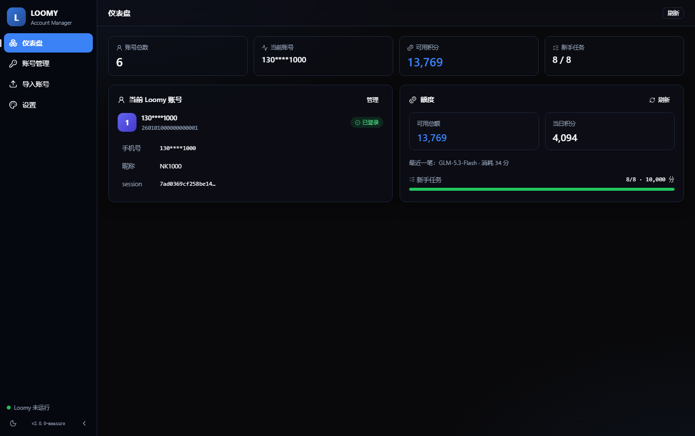
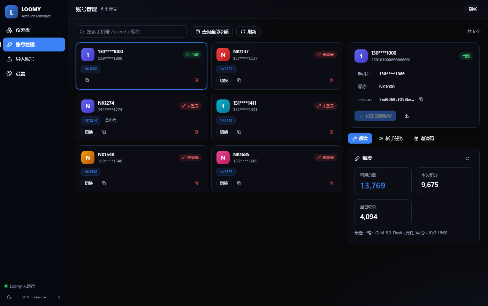
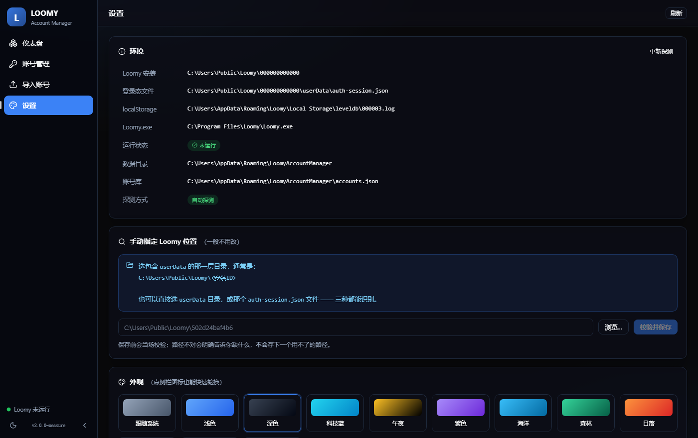

<div align="center">

# Loomy 账号管理器

**管理 Loomy 桌面端账号的桌面应用** —— 导入、一键切换、余额查询、新手任务、邀请码

[](https://github.com/Practice019/loomy-account-manager/actions/workflows/ci.yml)
[](https://github.com/Practice019/loomy-account-manager/releases/latest)
[](LICENSE)
[]()

[下载](../../releases/latest) · [故障排查](TROUBLESHOOTING.md) · [更新日志](CHANGELOG.md) · [参与贡献](CONTRIBUTING.md)

</div>

---

## 它解决什么问题

Loomy 桌面端一次只能登录一个账号。想换号得手动退出、重新登录，
而且登录态分散在几个地方，手工改很容易只改一半 —— 表现就是
"看起来切成功了，一重启又变回去"。

这个工具把这件事做成一次点击：账号存在本地，切换时**三个位置一起写**，
写完可以重启 Loomy 直接生效。

## 功能

| | 功能 | 说明 |
|---|---|---|
| 📥 | **导入账号** | 粘贴整份登录态 JSON，或从目录批量导入 |
| 🔄 | **一键切换** | 自动写三处登录态，切换前自动备份，可撤销 |
| 💰 | **余额查询** | 可用总额 / 永久积分 / 当日积分 / 最近一笔流水 |
| ✅ | **新手任务** | 查看 8 项任务进度，一键完成剩余全部 |
| 🎁 | **邀请码** | 查看激活状态、绑定邀请码、查看自己生成的码 |
| 🎨 | **12 套主题** | 跟随系统 / 浅色 / 深色 / 科技蓝 / 午夜 / 更多 |
| ↩️ | **备份与恢复** | 每次切换前自动备份，随时可回到之前的状态 |

## 截图

<div align="center">

**仪表盘** —— 一进来就知道当前用哪个号、还有多少额度、任务做完没有



**账号管理** —— 卡片网格 + 右侧详情，切换 / 查额度 / 看任务 / 管邀请码



**设置** —— 真实环境信息、手动指定 Loomy 位置、12 套主题、备份管理



</div>

## 下载

从 [Releases](../../releases/latest) 下载对应平台的安装包。**每个平台只需要一个文件**，不用全下：

| 系统 | 架构 | 文件 | 说明 |
|---|---|---|---|
| **Windows** | x64 | `LoomyAccountManager_<版本>_x64_zh-CN.msi` | WiX 安装包（推荐） |
| **Windows** | x64 | `LoomyAccountManager_<版本>_x64-setup.exe` | NSIS 安装包，与 `.msi` 等价，选一个即可 |
| **macOS** | Apple Silicon（M 系列） | `LoomyAccountManager_<版本>_aarch64.dmg` | 只能用于 ARM 芯片的 Mac |
| **macOS** | Intel | `LoomyAccountManager_<版本>_x64.dmg` | 只能用于 Intel 芯片的 Mac |
| **Linux** | x64 | `LoomyAccountManager_<版本>_amd64.AppImage` | 免安装，`chmod +x` 后直接运行 |
| **Linux** | x64 | `LoomyAccountManager_<版本>_amd64.deb` | Debian / Ubuntu |
| **Linux** | x64 | `LoomyAccountManager-<版本>-1.x86_64.rpm` | Fedora / RHEL / openSUSE |

> `.dmg` 是 **macOS** 的磁盘映像，Windows 打不开 —— Windows 请下 `.msi` 或 `.exe`。
> 不确定 Mac 是哪种芯片：左上角苹果菜单 →「关于本机」，看「芯片」一行。

Windows 需要 [WebView2](https://developer.microsoft.com/microsoft-edge/webview2/) 运行时
（Windows 11 已内置，Windows 10 一般也有，安装包会自动处理）。

> macOS 与 Linux 版本未做代码签名，首次打开可能需要在系统设置里放行。
> macOS 若提示「已损坏」无法打开，执行：
> `xattr -dr com.apple.quarantine /Applications/LoomyAccountManager.app`
> Windows 版安装到 `%LOCALAPPDATA%`，**不需要管理员权限**。

---

## 它是怎么工作的

### 为什么要写"三处"登录态

这是本项目最核心的一件事。Loomy 的登录态分布在**三个位置**，少写一个就不生效：

| # | 位置 | 谁读它 |
|---|---|---|
| ① | `C:\Users\Public\Loomy\<安装ID>\userData\auth-session.json` | 主进程（electron-store） |
| ② | `…\opencode\opencode.json` → `provider.imodel.options.apiKey` | opencode 运行时 |
| ③ | `%APPDATA%\Loomy\Local Storage\leveldb\*.log` | **渲染进程（localStorage）** |

**③ 是决定性的，也是最容易被漏掉的。**

追踪 Loomy 渲染进程的代码（`app.asar` → `dist/assets/sonner-*.js`）可以看到：

```js
function mM(){
  const e = F1()                                 // 读 localStorage["loomy-auth-session"]
  return window.electronAPI.auth.setSession({    // 推给主进程
    session: e.session, userid: e.userid, phone: e.phone
  })
}
```

**方向与直觉相反**：渲染进程把自己 localStorage 里的值推给主进程，
主进程据此**覆盖** `auth-session.json`。所以只写 ① 会发生：

```text
1. 我们写 auth-session.json = 新账号
2. Loomy 启动 → 渲染进程读它自己 localStorage 里的旧值
3. 调 auth.setSession() → 主进程把 auth-session.json 改回旧账号   ← 白切了
```

本工具三处一起写，并在界面上报告每一处的结果。

### 由此带来的一条限制

> **切换账号前必须完全退出 Loomy。**

客户端运行中时它内存里有 localStorage 副本，退出时会把旧值刷回磁盘 ——
我们的写入会被覆盖。这是客户端机制决定的，绕不过去。
应用会检测 Loomy 是否在运行，并提供「关闭并切换」。

### LevelDB 是手写的

没有引入 LevelDB 依赖 —— Chromium 的 localStorage 就是标准 LevelDB 格式，
本工具直接按日志格式追加写入（`src-tauri/src/session/leveldb.rs`）：

```text
块（32768 字节）内：crc32c(4) | length(2) | type(1) | data
crc = mask(crc32c(type_byte || data))
```

两个容易错的细节（都有测试守住）：

1. **key 里没有 origin 前缀。** 网上多数教程写 `_<origin>\x00\x01<key>`，
   但 Loomy 的 localStorage 只有一个来源，Chromium 于是省略了 —— 实际是
   `_file://\x00\x01loomy-auth-session`。照抄带 origin 的格式会写出一条
   **永远读不到**的记录。
2. **CRC 必须带掩码。** 漏了会让 Chromium 判定记录损坏。

`cargo test` 里有一条**拿真实文件校验 CRC** 的测试：算法或掩码写错会立刻变红，
而不是留下"读得出数据但 CRC 全错"这种最难发现的状态。

### 自动探测 + 手动兜底

按可靠性从高到低找 Loomy：

```text
① 用户手动指定的路径（设置里配的）
② C:\Users\Public\Loomy\<安装ID>\userData\auth-session.json
③ %APPDATA%\Loomy\auth-session.json
```

找不到时不会让你卡住 —— 界面会说明原因，并给出手动指定入口。
保存前**当场校验**，路径不对会明确告诉你缺什么，不会存下用不了的路径。
支持四种形态：安装根 / `userData` 子目录 / `auth-session.json` 文件 / 容器目录。

⚠️ 注意 `%APPDATA%` 下**几十个** Electron 应用都是同样的
`Local Storage\leveldb` 结构，所以本工具除了目录名还会校验内容
（日志里能否找到 `loomy-auth-session`）。

---

## 数据与隐私

| 内容 | 位置 |
|---|---|
| 账号库 | `%APPDATA%\LoomyAccountManager\accounts.json` |
| 备份 | `%APPDATA%\LoomyAccountManager\backups\` |
| 设置 | `%APPDATA%\LoomyAccountManager\config.json` |

> `%APPDATA%` 即 `C:\Users\<你>\AppData\Roaming`；macOS 与 Linux 对应各自的用户数据目录。

**不上传任何数据。** 除查询余额 / 任务 / 邀请码时调用 Loomy 官方接口外，
全部为本地文件操作。

⚠️ 账号库里含所有账号的 session（明文 JSON），**不要整个目录分享给别人**。

---

## 从源码运行

需要 **Rust 1.90+**、**Bun 1.1+**（或 npm），以及平台对应的 Tauri 依赖。

```bash
git clone git@github.com:Practice019/loomy-account-manager.git
cd loomy-account-manager
bun install

bun run app:dev      # 开发模式（热重载）
bun run app:build    # 打包出安装包
```

> ⚠️ 不要直接跑 `cargo run` 或 `target/debug/*.exe` —— debug 构建会去连
> Vite 开发服务器（`localhost:1420`），没启动它就会显示"拒绝连接"。

### 项目结构

```text
src-tauri/          Rust 后端
├─ src/
│  ├─ lib.rs            应用装配（命令注册、窗口尺寸自适应）
│  ├─ main.rs           启动壳
│  ├─ core/             路径、账号模型、配置、错误、工具 —— 不认识 Tauri
│  ├─ session/          登录态三处写入 + LevelDB 实现
│  ├─ clients/          上游 HTTP（积分网关）
│  └─ commands/         Tauri IPC 入口
├─ tests/
│  ├─ integration.rs    用**真实**本机环境验证（只读，缺前置则跳过）
│  └─ e2e_switch.rs     真的切一次账号再还原（需显式 --ignored）
└─ examples/            开发用小工具

src/                React 前端
├─ App.tsx
├─ api/tauri.ts         invoke 的类型化封装
├─ components/
└─ lib/theme.ts         主题注册表
```

**分层原则**：`core` 与 `session` 不 import `tauri::*` ——
这样它们能在单元测试里直接跑，不必启动整个应用。

### 测试

```bash
cd src-tauri
cargo test                                     # 全部（单元 + 集成，只读，安全）
cargo test --test integration -- --nocapture    # 看真实环境观察到什么
cargo test --test e2e_switch -- --ignored       # 真的切账号（需先关闭 Loomy）
```

集成测试会读**真实**的本机环境并打印观察到的数据（安装路径、leveldb 位置、
当前账号）。缺前置条件时**跳过而不是失败** —— 没装 Loomy 的机器也能跑。

### 开发工具

```bash
cd src-tauri
cargo run --example seed -- "<含账号 JSON 的目录>"   # 批量导入
cargo run --example probe_points                      # 实测余额 / 任务 / 邀请码
cargo run --example probe_points -- <uid> bind-check  # 校验绑定请求体形状（非破坏性）
cargo run --example probe_status                      # 打印真实环境路径
cargo run --example probe_ipc                         # 验证发往前端的 JSON 形状

# 布局溢出测量（开发工具，不进构建产物）
bun run dev   # 然后打开 http://localhost:1420/measure.html
```

> `probe_ipc` 存在的理由：**单测用手写数据，它用线上真实数据**。
> 曾经因此抓到一个 bug —— 上游实际返回 `status: "active"`，
> 而手写的测试数据里是 `"available"`，两者不同导致整列显示错误。

---

## 参与贡献

见 [CONTRIBUTING.md](CONTRIBUTING.md)。提交前请确保：

```bash
bun x tsc --noEmit
cd src-tauri && cargo fmt --all -- --check && cargo clippy --all-targets -- -D warnings && cargo test
```

遇到问题先看 [TROUBLESHOOTING.md](TROUBLESHOOTING.md) ——
多数"坏了"的情况其实是 Loomy 客户端的机制决定的，不是缺陷。

## 许可

[MIT](LICENSE)

---

<div align="center">
<sub>本项目与 Loomy 官方无关，为第三方工具。</sub>
</div>
